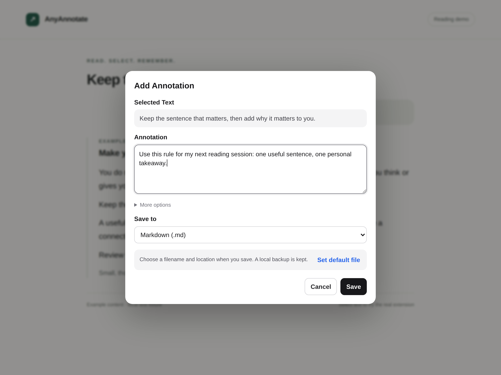
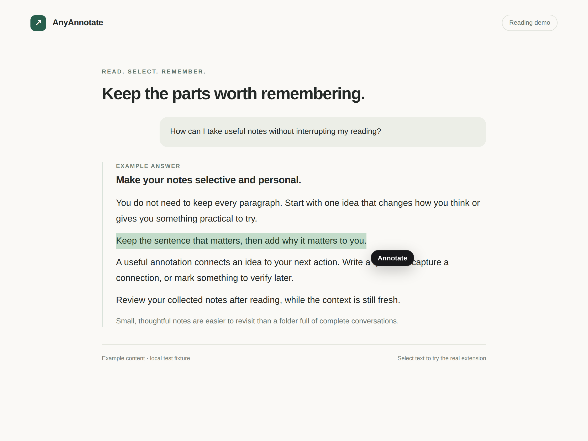
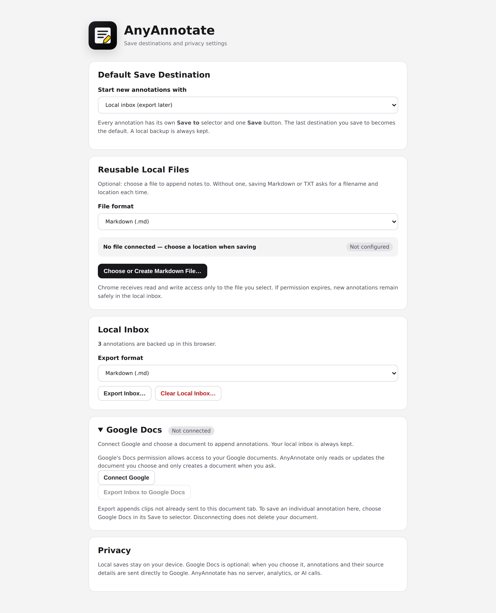

# AnyAnnotate

[Install AnyAnnotate from the Chrome Web Store](https://chromewebstore.google.com/detail/mkdeklipbgfjoibioofimhcklfikgmgo)

AnyAnnotate is a local-first annotation tool for keeping the parts of an article, document, or AI answer that matter. Select text, add a note, and choose Google Docs, Markdown, plain text, or a local inbox without interrupting your reading flow.

The project includes a macOS app for system-wide annotation, a Chrome extension for ordinary web pages, and an experimental local-only MCP app. All product UI, messages, exports, tests, and documentation are written in English.

## See it in action

Select a sentence, add your own thought, choose **Save to**, and click the single **Save** button.



These are screenshots of the real extension running in Chromium. The background uses an English reading fixture, not a live ChatGPT conversation. The example notes are saved by the extension during its [end-to-end test](docs/TESTING.md).

<details>
<summary>See text selection and the local inbox</summary>

Select the part you want to keep. The **Annotate** button appears beside the selection.



Keep collecting while you read, then export your annotations together as Markdown or TXT. Settings also lets you connect a reusable file for each format.



</details>

## Features

- Shows an **Annotate** button next to a real text selection
- Works on HTTP and HTTPS articles, reference pages, blogs, and AI conversations, including ChatGPT
- Saves the selected quote with an optional annotation, category, and tags
- Supports repeated, serialized clipping into a Markdown or TXT file in Chrome
- Lets you choose a destination for each clip or set a default file
- Keeps a browser-local inbox backed by IndexedDB, with export and clear controls
- Optionally appends annotations to a selected Google Doc, with local copies and duplicate-safe retry
- Records the source application and save time
- Provides `Option-Command-A` to annotate and `Option-Command-S` to save quickly
- Local saving works without an account or network request; Google Docs requires an explicit connection
- Does not read, clear, or modify the system clipboard

## Download

- **Chrome:** install [AnyAnnotate from the Chrome Web Store](https://chromewebstore.google.com/detail/mkdeklipbgfjoibioofimhcklfikgmgo). No Node.js, npm, server, or API key is needed for local saving.
- **macOS:** download the app from [GitHub Releases](https://github.com/guoziyu415/anyannotate/releases), or [build it from source](#build-from-source).
- **Source:** the Chrome extension is also available under `chrome-extension` in this repository.

The source repository is public. See the [product website](https://guoziyu415.github.io/anyannotate/) and [privacy policy](https://guoziyu415.github.io/anyannotate/privacy.html).

## macOS app

The macOS app works with ChatGPT Desktop, browsers, PDF readers, and other applications that expose selected text through macOS Accessibility.

### Install a release

1. Download the latest `AnyAnnotate-macOS-` archive from GitHub Releases.
2. Unzip it and move the included app to `Applications`.
3. Open the app. If macOS blocks the first launch, right-click the app, choose **Open**, and confirm.
4. Select **Accessibility Permission...** from the highlighter icon in the menu bar.
5. Enable AnyAnnotate in **System Settings > Privacy & Security > Accessibility**.
6. Select text in any supported app and click the floating **Annotate** button.
7. Add a note and press `Command-Enter` to save.

The default destination is `~/Documents/AnyAnnotate/Inbox.md`. You can choose another Markdown file for one clip, make it the new default, or change the default later from the menu bar.

Upgrading from version 0.2 moves your existing default notes folder to `~/Documents/AnyAnnotate` on first launch and keeps a custom location. Version 0.3 has a new app identity, so enable it again under **Accessibility** and remove the entry for the old app.

### Build from source

Install Xcode Command Line Tools or Xcode, then run:

```bash
./scripts/build-app.sh
```

Open `build/AnyAnnotate.app` and grant Accessibility permission when prompted.

To regenerate the macOS icon from the shared SVG source:

```bash
./scripts/build-macos-icon.sh
```

For a stable development signature that preserves Accessibility permission across rebuilds:

```bash
CODE_SIGN_IDENTITY="Apple Development: your-name@example.com (TEAMID)" ./scripts/build-app.sh
```

When full Xcode is available, the build script creates a universal Apple Silicon and Intel binary without changing the system-wide developer directory. Without full Xcode, it creates a native-architecture development build. Without `CODE_SIGN_IDENTITY`, the app uses a local ad-hoc signature.

For a notarized release, first store notarization credentials in a keychain profile, then run:

```bash
CODE_SIGN_IDENTITY="Developer ID Application: Your Name (TEAMID)" \
NOTARY_PROFILE="anyannotate-notary" \
./scripts/package-macos-app.sh
```

## Chrome extension

The Chrome extension works on ordinary HTTP and HTTPS pages, including articles, blogs, reference pages, and AI conversations such as ChatGPT. It does not require macOS Accessibility permission; use the macOS app for desktop applications.

### Install

Install [AnyAnnotate from the Chrome Web Store](https://chromewebstore.google.com/detail/mkdeklipbgfjoibioofimhcklfikgmgo), then open or refresh a web page, select text, and click **Annotate**.

### Install from source

1. Download the repository with **Code > Download ZIP**, or clone it with Git.
2. Unzip the repository archive if necessary.
3. Open `chrome://extensions` in Chrome.
4. Enable **Developer mode**.
5. Select **Load unpacked** and choose the repository's `chrome-extension` folder.
6. Open or refresh a web page you want to annotate.
7. Select text and click **Annotate**.

Each annotation has a **Save to** selector: **Markdown (.md)**, **Plain text (.txt)**, **Google Docs**, or **Local inbox (export later)**. Choose the destination, then click **Save**. The last saved choice is remembered for the next annotation; you can override it without leaving the dialog.

For Markdown or TXT, Save appends to that format's reusable file if connected; otherwise it opens Chrome's save-location dialog. Exports focus on the quote and your annotation, without repeated titles or metadata fields. Connect separate default files under **Settings > Reusable Local Files**. To collect notes before exporting, choose **Local inbox (export later)**, then export the inbox as Markdown or TXT from the popup or settings.

Each annotation is saved to IndexedDB first. Writes from multiple tabs and websites are serialized to prevent lost updates. Each clip keeps its own page title and source link. A canceled download leaves the local copy intact. If a file or Google write fails, the dialog keeps your draft and displays an error so you can retry or choose another destination.

If you already installed an older version, click **Reload** on its card in `chrome://extensions`, review any updated site-access prompt, and refresh the open pages. Reloading preserves the local inbox. Chrome's extension site-access controls let you limit which websites it can run on.

For a local HTML document, enable **Allow access to file URLs** in the extension's **Details**, then open the file in Chrome. This also lets you try `chrome-extension/tests/e2e/reading-fixture.html` directly. The in-app browser does not load the Chrome extension.

The extension uses standard text selections in the top-level page. Input fields, password fields, and editable areas are excluded. Chrome settings pages, the Chrome Web Store, built-in PDF viewers, text drawn inside a canvas, and text inside embedded frames are not supported.

Run the extension tests:

```bash
cd chrome-extension
npm ci
npm test
```

For a real browser test and reproducible screenshots, see [Testing and screenshots](docs/TESTING.md).

Create a Chrome Web Store upload archive:

```bash
./scripts/package-chrome-extension.sh
```

See [STORE_LISTING.md](chrome-extension/STORE_LISTING.md) for listing copy and permission explanations, and [PRIVACY.md](chrome-extension/PRIVACY.md) for the privacy policy.

### Save to Google Docs

Google Docs is an optional destination. It needs a Google OAuth client registered for the installed extension ID; see [Google Docs setup](docs/GOOGLE_DOCS.md). A configured development client is not automatically valid for someone else's unpacked installation. If Settings says **Setup required**, that build has no client configured.

Once configured, open **Configure Save Destinations > Google Docs > Connect Google**. Paste an existing document link or create a new document. In the annotation dialog, choose **Google Docs** under **Save to** and click **Save**. The selected document's title is shown before saving. Alternatively, use **Export Inbox to Google Docs** to send collected notes together. A link's `tab` parameter selects the destination tab; otherwise the first tab is used. Connecting or choosing a document never silently switches local saves to the cloud.

New content is appended to the document. Local notes remain available if a request fails. Re-export checks tracking ranges in the selected document tab to avoid duplicating entries that were already written.

## Experimental MCP app

`plugins/anyannotate` provides an optional local in-chat workspace for collecting, editing, reordering, and exporting clips. Because ChatGPT widgets run in an isolated iframe, the MCP version cannot directly capture text selected in the surrounding conversation. The macOS app or Chrome extension is recommended for selection-based annotation.

The MCP server intentionally binds only to a loopback address. Its browser preview API rejects cross-origin access. It remains a single-user development tool and must not be exposed as a public service without authentication and per-user storage.

See [plugins/anyannotate/README.md](plugins/anyannotate/README.md) for development instructions.

## Development

The macOS app uses Swift Package Manager, has no third-party dependencies, and supports macOS 13 or later.

Run the Swift tests:

```bash
swift test
```

Run the English-only repository check:

```bash
node scripts/check-english.mjs
```

GitHub Actions runs the English check, Chrome unit and browser tests, MCP tests and build, Swift tests, and a universal macOS build check.

## Note format

Chrome exports use a compact reading format: the excerpt first, your annotation once beneath it, and a short source title at the end. Markdown uses a blockquote and a titled link; Google Docs uses an indented quote and a smaller native source hyperlink. TXT uses quotation marks and a source title only, since plain text cannot hide a URL behind a clickable label.

```markdown
> The selected part of the answer.

Try this idea in my next reading session.

[Example article](<https://example.org/article>)

---
```

Category, tags, timestamps, and the complete source URL remain in the local inbox. They are not printed as fields in Chrome exports. **More options** in the annotation dialog holds the optional category and tags. Existing saved files and Google entries are not rewritten; the new format applies to new saves and new local exports. Re-exporting to the same Google document still skips entries already present. The macOS app retains its original detailed Markdown format.

## Privacy

AnyAnnotate does not call an AI model or create new chat messages. Local saving keeps data in browser storage or a user-selected Markdown or TXT file. If you opt into Google Docs, annotations and source details are sent directly to Google's Docs API; no AnyAnnotate server receives them. Chrome manages OAuth tokens, and the app never returns them to web pages. The macOS app writes only to the selected Markdown file.

## License

AnyAnnotate is available under the [MIT License](LICENSE).
